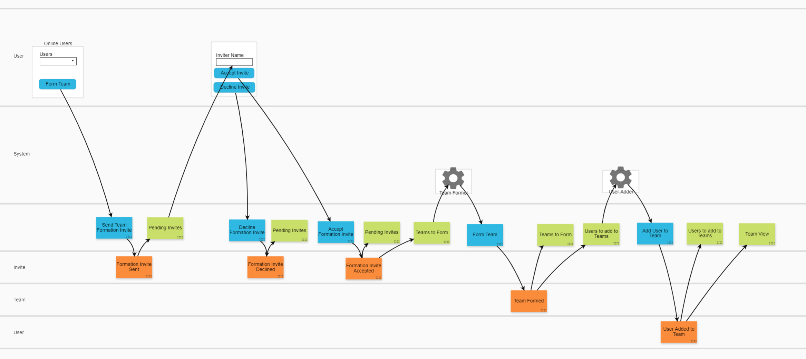
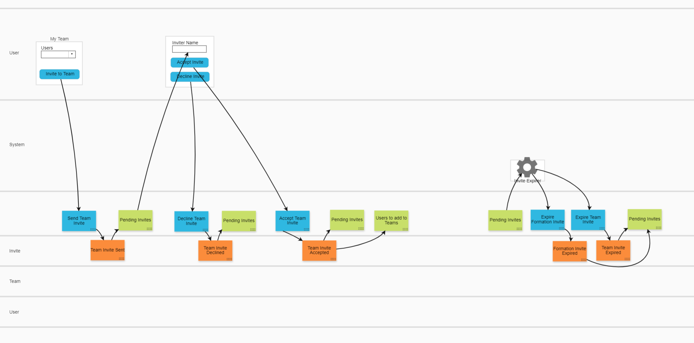

# lb-teams

This is a playground project for exploring the use of [Liftbridge](https://liftbridge.io/) as an [event store](https://en.wikipedia.org/wiki/Event_store).

The goal of this project is to implement a simple domain of **Users** and **Teams**, where users can be invited to teams, accept invites to teams, leave teams, and remove other team members (assuming they're the team owner).

## API

### Commands

* Send Team Formation Invite: `curl -XPOST localhost:8080/SendTeamFormationInvite -d '{"inviterUserId":"alice","inviteeUserId":"bob"}'`
* Send Team Formation Invite: `curl -XPOST localhost:8080/DeclineTeamFormationInvite -d '{"inviteId":"abc123"}'`
* Send Team Formation Invite: `curl -XPOST localhost:8080/CancelTeamFormationInvite -d '{"inviteId":"abc123"}'`
* Send Team Formation Invite: `curl -XPOST localhost:8080/AcceptTeamFormationInvite -d '{"inviteId":"abc123"}'`

### Queries

* Get User Inbox: `curl localhost:8080/Inbox?userid=bob`

## Model

This project is being designed using [Event Modelling](https://eventmodeling.org/)

 
